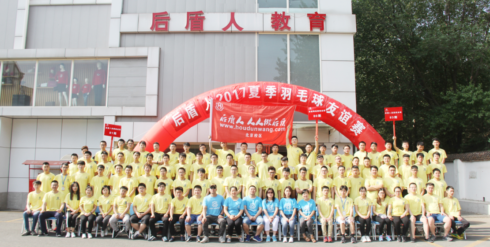
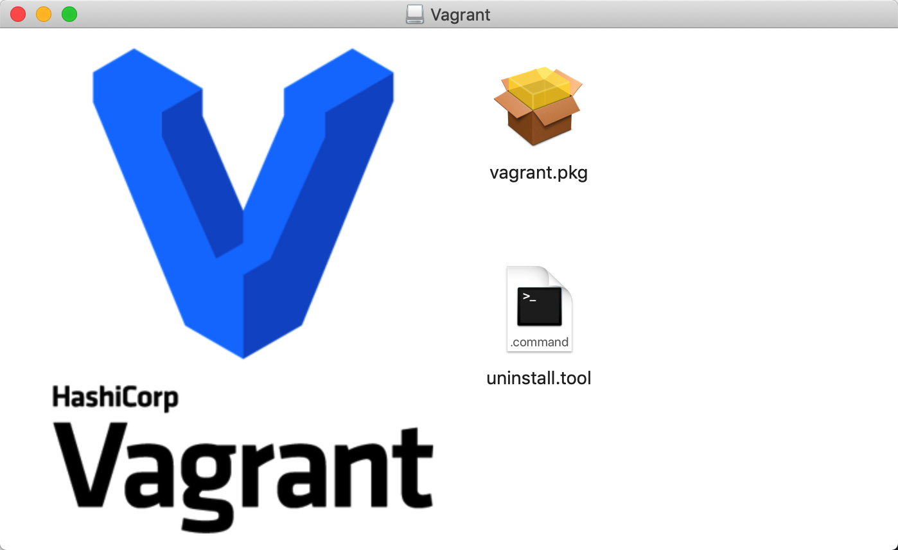
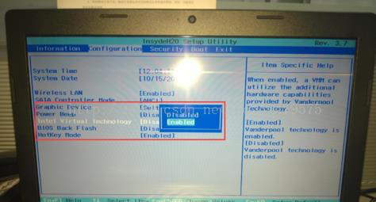

# Homestead Win



> 后盾人 www.houdunren.com  作者：向军大叔

Laravel 致力于让整个 PHP 开发体验变得愉快， 包括你的本地开发环境。 Vagrant 提供了一种简单，优雅的方式来管理和配置虚拟机。
Laravel Homestead 是一个官方预封装的 Vagrant box，它为你提供了一个完美的开发环境，而无需在本地机器安装 PHP 、Web 服务器和其他服务器软件。不用担心会搞乱你的操作系统！Vagrant boxes 是一次性的。如果出现问题，你可以在几分钟内销毁并创建 Box!
Homestead 可以运行在任何 Windows，Mac，或 Linux 系统，它包括了 Nginx web 服务器， PHP 7.2，PHP 7.1，PHP 7.0，PHP 5.6， MySQL，PostgreSQL，Redis，Memcached， Node，以及开发 Laravel 应用程序所需要的东西。

> 以下代码都是在windows 使用 [git for windows](https://gitforwindows.org/) 命令行工具操作的

## VirtualBox
https://www.virtualbox.org/ 
VirtualBox 是 Oracle 公司的开源虚拟机软件。VirtualBox 号称是最强的免费虚拟机软件，它不仅功能齐全，而且性能也很优异！VirtualBox 支持大部分流行的系统，如：Mac, Windows, Linux 等。

## Vagrant
[Vagrant by HashiCorp](https://www.vagrantup.com/)
Vagrant 是用来管理虚拟机的工具，支持当前主流的虚拟机系统如 VirtualBox、VMware、AWS 等。Vagrant 的主要作用是提供一个可配置、可移植和复用的软件环境。Vagrant 让你通过编写一个 Vagrantfile 文件来控制虚拟机的启动、虚拟机网络环境的配置、虚拟机与主机间的文件共享，以及启动后自动执行一些配置脚本，如自动执行一个 Shell Script 来安装一些必备的开发工具，如安装配置MySQL、PHP，甚至是自动配置 Nginx 站点。这意味着，在一个多人开发的项目中，你只需要同步 Vagrantfile 文件，就可以保证参与项目的每个人各自的机器上拥有一致的开发环境。
可以在下面网站上搜索需要的vagrant box
https://app.vagrantup.com/boxes/search

#### 卸载程序和依赖

在下载的安装包里有一个删除工具，可以直播删除 Vagrant软件。



也可以使用下面命令删除

```
# 删除软件
rm -rf /opt/vagrant
rm -f /usr/local/bin/vagrant
sudo pkgutil --forget com.vagrant.vagrant

#删除用户数据
rm -rf ~/.vagrant 
rm -rf ~/.vagrant.d
```

## Homestead box

Homestead是一个官方预封装的 Vagrant box，它为你提供了一个完美的开发环境，而无需在本地机器安装 PHP 、Web 服务器和其他服务器软件。不用担心会搞乱你的操作系统！Vagrant boxes 是一次性的。如果出现问题，你可以在几分钟内销毁并创建 Box!

内置软件：Ubuntu 16.04、Git、PHP 7.2、PHP 7.1、Nginx、Apache (Optional)、MySQL ……

在线安装 Homestead Vagrant Box，这样安装下载会非常慢，可以使用第二种本地文件安装方式
```
vagrant box add laravel/homestead
```

本地文件安装
先下载离线 `homestead.box`  https://pan.baidu.com/s/1-obdVwlryRdtVV-8-iD56A  然后执行
```
vagrant box add laravel/homestead d:/code/homestead.box
```

安装的box 镜像储存的位置：以我电脑为例在 `~/.vagrant.d/boxes`  

## 安装 Homestead 管理脚本
```
#clone管理脚本
git clone https://github.com/laravel/homestead.git ~/Homestead
cd ~/Homestead

#因为master不稳定所以切到稳定tag 
git checkout v7.3.0

#创建 Homestead.yaml 配置文件
./init.bat
```

如果是本地安装的 homestead.box 版本为0，所以需要修改下面步骤生成的配置文件 /Users/xj/Homestead/scripts/homestead.rb 以下内容
```
config.vm.box_version = settings["version"] ||= ">= 0"
```

## SSH 秘钥登录

用于实现 SSH 免密码登录
修改 Homestead.yaml 文件以下内容：
```
keys:
    - ~/.ssh/id_rsa
    - ~/.ssh/id_rsa.pub
```

生成 key
```
ssh-keygen -t rsa -C "2300071698@qq.com"
#后面一真按enter键，设置密码
```

## 配置共享文件夹
Homestead.yaml 文件的 folders 属性里列出所有与 Homestead 环境共享的文件夹。这些文件夹中的文件若有变更，它们会保持本地机器与 Homestead 环境之间同步。你可以根据需要配置多个共享文件夹：
```
folders:
    - map: d:/code
      to: /home/vagrant/Code
# map 对应的是我们本机的文件夹
* to 对应的是 Homestead 上的文件夹
```

## vagrant命令
```
#启动 如果加上 --provision 选项那么添加的新站点会发布到虚拟机上。
cd ~/Homestead && vagrant up

#关闭
vagrant halt

#通过 SSH 登录 vagrant（需要先启动 vagrant）
vagrant ssh

#查看目前安装的box列表
vagrant box list

#删除box镜像
vagrant box remove laravel/homestead

#查看当前 Homestead 虚拟机的状态。
vagrant status
```

## 通过 SSH 连接
这样就可以登录的 homestead 虚拟主机了，此地可以查看上面定义的本地目录与虚拟机目录同步的情况
```
vagrant ssh
```

## 数据库
* 要从主机的数据库客户端连接到 MySQL，就连接到 127.0.0.1和端口 33060 (MySQL) 。账号密码分别是 homestead／secret。
* PHP程序连接（虚拟机中连接）端口为 3306

## 全局命令

**Git for Windows环境中使用**

如果我们想在任何目录都可以执行 vagrant 命令，需要进行以下设置
修改 ~/.bash_profile 文件内容，这种设置只在 `git for windows` 软件中使用
```
function homestead() {
    ( cd ~/Homestead && vagrant $* )
}
```
这样我们就可以使用 homestead up 等方式执行了。

**设置Windows全局命令**

```
@echo off

set cwd=%cd%
set homesteadVagrant=C:\Users\xj\Homestead

cd /d %homesteadVagrant% && vagrant %*
cd /d %cwd%

set cwd=
set homesteadVagrant=
```

你需要将脚本中实例路径 C:\Homestead 调整为 Homestead 实际安装路径。创建文件之后，添加文件路径到 PATH，这样你就可以在系统的任意位置运行 homestead up 或 homestead ssh 命令了。 

如果想让计算机启动时执行  homestead ，在` 开始菜单->所有程序->启动` 文件夹中设置 homestead.bat内容如下。

```
homestead up
```

## 开机自启

在 `开始菜单>启动` 文件夹中创建 `homestead.bat` 文件内容如下

```
homestead up
```

要在360或腾讯电脑管家中的启动项中不要禁用。

## 响应缓慢

解决WINDOS系统下Homestead运行缓慢的问题

> 一定要先备份

首先，命令行进入 Homestead 启动 vagrant

```
> cd ~/Homestead && vagrant up
```

然后运行安装命令（如果下载失败可能被墙了）

```
$ vagrant plugin install vagrant-winnfsd
```

修改文件1：`homestead/scripts/homestead.rb`

查找此段代码（可能略有不同），替换为以下内容

```
if settings.include? 'folders'
  settings["folders"].sort! { |a,b| a["map"].length <=> b["map"].length }

  settings["folders"].each do |folder|
    config.vm.synced_folder folder["map"], folder["to"], 
    id: folder["map"],
    :nfs => true,
    :mount_options => ['nolock,vers=3,udp,noatime']
  end
end
```

文件2：`Homestead.yaml`

```
folders:
    - map: ~/Code
      to: /home/vagrant/Code
      type: nfs
```

重启 Homestead 使配置文件生效，大功告成。

## 配置域名

修改 `c:/windows/System32/drivers/etc/hosts` 文件，因为 `hosts` 文件不能直接修改，需要先移动到桌面或其他文件夹，然后添加如下内容，添加好后再将文件移动回来。

```
192.168.10.10  hdcms.hd
```

上面定义了一个域名 hdcms.hd 指向我们的homestead服务器，在homestead.yaml文件内定义域名解析配置：

```
sites:
    - map: hdcms.hd
      to: /home/vagrant/code/hdcms
```

现在当我们访问 hdcms.hd 时会访问到 homestead服务器下的 `/home/vagrant/code/hdcms` 目录

## Win10安装错误

执行 `cd ~/Homestead && vagrant up` 开启虚拟机出现以下错误

```
Timed out while waiting for the machine to boot. This means that
Vagrant was unable to communicate with the guest machine within
the configured ("config.vm.boot_timeout" value) time period.

If you look above, you should be able to see the error(s) that
Vagrant had when attempting to connect to the machine. These errors
are usually good hints as to what may be wrong.
...
```

进入你的BIOS，然后将virtualization（CPU虚拟化）设置为enable即可

BIOS界面：Configuratio > Intel Virtual Technology > Enabled



# Homestead Mac


> 后盾人 wwwhoudunren.com  作者：向军大叔

Laravel 致力于让整个 PHP 开发体验变得愉快， 包括你的本地开发环境。 Vagrant 提供了一种简单，优雅的方式来管理和配置虚拟机。
Laravel Homestead 是一个官方预封装的 Vagrant box，它为你提供了一个完美的开发环境，而无需在本地机器安装 PHP 、Web 服务器和其他服务器软件。不用担心会搞乱你的操作系统！Vagrant boxes 是一次性的。如果出现问题，你可以在几分钟内销毁并创建 Box!
Homestead 可以运行在任何 Windows，Mac，或 Linux 系统，它包括了 Nginx web 服务器， PHP 7.2，PHP 7.1，PHP 7.0，PHP 5.6， MySQL，PostgreSQL，Redis，Memcached， Node，以及开发 Laravel 应用程序所需要的东西。

## VirtualBox
https://www.virtualbox.org/ 
VirtualBox 是 Oracle 公司的开源虚拟机软件。VirtualBox 号称是最强的免费虚拟机软件，它不仅功能齐全，而且性能也很优异！VirtualBox 支持大部分流行的系统，如：Mac, Windows, Linux 等。

## Vagrant
[Vagrant by HashiCorp](https://www.vagrantup.com/)
Vagrant 是用来管理虚拟机的工具，支持当前主流的虚拟机系统如 VirtualBox、VMware、AWS 等。Vagrant 的主要作用是提供一个可配置、可移植和复用的软件环境。Vagrant 让你通过编写一个 Vagrantfile 文件来控制虚拟机的启动、虚拟机网络环境的配置、虚拟机与主机间的文件共享，以及启动后自动执行一些配置脚本，如自动执行一个 Shell Script 来安装一些必备的开发工具，如安装配置MySQL、PHP，甚至是自动配置 Nginx 站点。这意味着，在一个多人开发的项目中，你只需要同步 Vagrantfile 文件，就可以保证参与项目的每个人各自的机器上拥有一致的开发环境。
可以在下面网站上搜索需要的vagrant box
https://app.vagrantup.com/boxes/search

## Homestead box
Homestead是一个官方预封装的 Vagrant box，它为你提供了一个完美的开发环境，而无需在本地机器安装 PHP 、Web 服务器和其他服务器软件。不用担心会搞乱你的操作系统！Vagrant boxes 是一次性的。如果出现问题，你可以在几分钟内销毁并创建 Box!

内置软件：Ubuntu 16.04、Git、PHP 7.2、PHP 7.1、Nginx、Apache (Optional)、MySQL ……

在线安装 Homestead Vagrant Box，这样安装下载会非常慢，可以使用第二种本地文件安装方式
```
vagrant box add laravel/homestead
```

本地文件安装
先下载 [离线 homestead.box](https://pan.baidu.com/s/1kFMKGzIxKCdcX4F6wwCBHA) ，然后执行
```
vagrant box add laravel/homestead ~/Desktop/homesteadvirtual5.2.box 
```

## 安装 Homestead 管理脚本
```
#clone管理脚本
git clone https://github.com/laravel/homestead.git ~/Homestead
cd Homestead

#因为master不稳定所以切到稳定tag 
git checkout v7.7.0

#创建 Homestead.yaml 配置文件
bash init.sh
```

如果是本地安装的 homestead.box 版本为0，所以需要修改下面步骤生成的配置文件 /Users/xj/Homestead/scripts/homestead.rb 以下内容

```
config.vm.box_version = settings["version"] ||= ">= 0"
```

安装的box 镜像储存的位置：以我电脑为例在 `/Users/xj/.vagrant.d/boxes` 

## 配置共享文件夹

Homestead.yaml 文件的 folders 属性里列出所有与 Homestead 环境共享的文件夹。这些文件夹中的文件若有变更，它们会保持本地机器与 Homestead 环境之间同步。你可以根据需要配置多个共享文件夹：
```
folders:
    - map: ~/Code  
      to: /home/vagrant/Code
      type: nfs
# map 对应的是我们本机的文件夹
# to 对应的是 Homestead 上的文件夹
# type 这样可以提升加载速度
```

## SSH 秘钥登录
用于实现 SSH 免密码登录
修改 Homestead.yaml 文件以下内容：
```
keys:
    - ~/.ssh/id_rsa
    - ~/.ssh/id_rsa.pub
```

生成 key
```
ssh-keygen -t rsa -C "2300071698@qq.com"
#后面一真按enter键，设置密码
```

## vagrant命令

```
#启动 如果加上 --provision 选项那么添加的新站点会发布到虚拟机上。
cd ~/Homestead && vagrant up

#关闭
vagrant halt

#通过 SSH 登录 vagrant（需要先启动 vagrant）
vagrant ssh

#查看目前安装的box列表
vagrant box list

#删除box镜像
vagrant box remove laravel/homestead

#查看当前 Homestead 虚拟机的状态。
vagrant status
```

## 通过 SSH 连接
这样就可以登录的 homestead 虚拟主机了，此地可以查看上面定义的本地目录与虚拟机目录同步的情况
```
vagrant ssh
```

## 配置域名

修改 `/etc/hosts` 文件添加如下内容。

```
192.168.10.10  hdcms.hd
```

上面定义了一个域名 hdcms.hd 指向我们的homestead服务器，在homestead.yaml文件内定义域名解析配置：

```
sites:
    - map: hdcms.hd
      to: /home/vagrant/code/hdcms
```

现在当我们访问 hdcms.hd 时会访问到 homestead服务器下的 `/home/vagrant/code/hdcms` 目录

## 数据库

* 要从主机的数据库客户端连接到 MySQL，就连接到 127.0.0.1和端口 33060 (MySQL) 。账号密码分别是 homestead／secret。
* PHP程序连接（虚拟机中连接）端口为 3306

## 全局命令
如果我们想在任何目录都可以执行 vagrant 命令，需要进行以下设置
修改 ~/.bash_profile 文件，如果安装了 zsh 需要修改 ~/.zshrc文件
```
function homestead() {
    ( cd ~/Homestead && vagrant $* )
}
```
这样我们就可以使用 homestead up 等方式执行了
