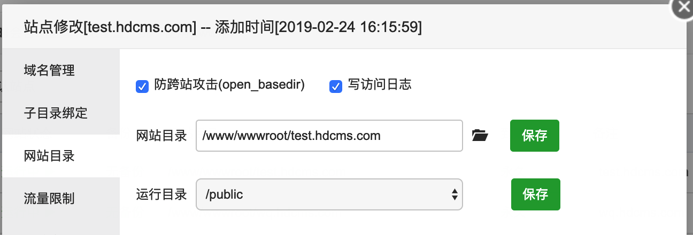
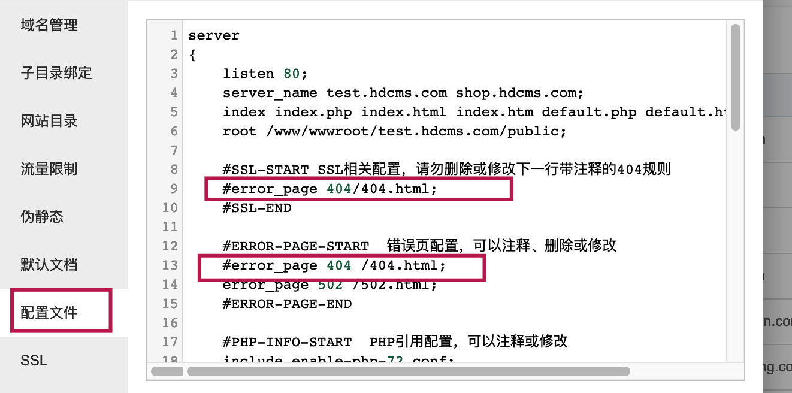

# HDCMS

## 安装配置

### 软件安装


### 服务器配置

下面是宝塔面板为例进行说明

#### 设置访问目录

将网站运行目录指向到 `public`



#### 开启404

注释掉以下网站配置项，可以开启Laravel Router 404。（如果你想使用服务器的404页面，就不需要设置了）

````
#error_page 404 /404.html;
````



## 中间件

| 中间件 | 说明                                         |
| ------ | -------------------------------------------- |
| modue  | 加载站点与模块数据。后台模块开发时必须使用。 |

## 常用函数

### route_class

根据路由生成以 `-` 分隔的css样式名称

```
/**
 * 根据路由设置样式类
 * @return string|null
 */
function route_class()
```

### isSuperAdmin

超级管理员检测

```
/**
 * 超级管理员检测
 * @return bool
 */
function isSuperAdmin(): bool
```


### module_access

模块权限判断

```
/**
 * 模块权限判断
 * @param string $permission 权限标识
 * @param string|null $module 模块标识
 * @param bool $abort 验证失败时显示错误页面
 * @return mixed
 * @throws Exception
 */
function module_access(string $permission, string $module = null, $abort = false)
```

### site

获取当前站点对象，只在后台站点管理和前台有效。

```
/**
 * 保存或获取当前站点
 * @param \App\Models\Site|null $site 站点模型
 * @return \App\Models\Site
 */
function site(\App\Models\Site $site = null): ?\App\Models\Site
```

### module

获取当前使用的模块对象，只在后台站点管理和前台有效。

```
/**
 * 保存或获取当前模块
 * @param \App\Models\Module $module 模型对象
 * @return \App\Models\Module|null
 */
function module(\App\Models\Module $module = null): ?\App\Models\Module
```

### tableForeign

函数用于实现表关联的外键约束。

```
/**
 * 表外键关联约束
 * @param Illuminate\Database\Schema\Blueprint $table Blueprint 迁移对象(直接传递迁移文件中的$table)
 * @param string $tableName 关联表
 * @param string $foreignKey 关联字段
 */
function tableForeign(\Illuminate\Database\Schema\Blueprint $table, string $tableName, string $foreignKey): void
```

## 系统管理

#### 系统配置

系统配置主要是影响后台系统管理


获取系统配置如下（系统变量可以后台查看）

```
{{config_get('变量名','默认值','system')}}
```


## 站点管理

### 站点配置

每个站点拥有独立的配置项。


使用以下方式获取站点配置

```
{{config_get('变量名','默认值','site')}}
```

## 模块开发

### 生成链接

使用 `module_link` 函数可以方便的生成模块链接，函数会添加 `sid` 站点编号与 `mid` 模块编号。

```
module_link(路由，路由参数)
```

也可以使用系统 route()函数生成路由，但需要手动添加 `sid` 与 `mid` 参数

```
route(路由，['sid'=>site()['id'],'mid'=>module()['mid']])
```

### 域名访问

**配置域名**

在模块设计时开启 `系统菜单>域名管理`  选项后，在站点管理下就有模块域名设置菜单了。


**域名访问**

使用域名会访问到模块的 `SystemController` 控制器的 `domain` 方法

## 微信公众号

对微信公众号的支持我们提供了非常丰富的功能。

### 模块配置

#### 数据表

执行 `artisan module:make-migration News Shop`在 `Shop` 模块中创建数据表 `News` ，并且数据表必须存在 `site_id` 与 `module_id` 字段

```
Schema::create('news', function (Blueprint $table) {
	$table->increments('id');
	$table->string('content')->comment('回复的文本内容');
	tableForeign($table, 'sites', 'site_id');
	tableForeign($table, 'modules', 'module_id');
	$table->timestamps();
});
```

#### 模型

使用 `artisan module:make-model News Shop` 在 `Shop` 模块中创建模型`News` ,并在模型中创建与微信关键词表的关联的函数。

```
public function keyword()
{
	return $this->morphOne(Keyword::class, 'model');
}
```

#### 控制器

```
...
class TextController extends Controller
{
	public function create(Text $text)
	{
        return view('module.text.create',compact('text'));
	}
	
	public function store(Request $request, ChatServer $server)
	{
        $data = $request->input();
        $data['site_id'] = site()['id'];
        $data['module_id'] = module()['id'];

        //保存微信数据
        \DB::beginTransaction();
        $server->save(Text::create($data));
        \DB::commit();
        return redirect(module_link('module.text.index'))->with('success', '保存成功');
	}

	public function edit(Text $text)
	{
        return view('module.text.edit', compact('text'));
	}

	public function update(Request $request, Text $text, ChatServer $server)
	{
        \DB::beginTransaction();
        $text->update($request->input());
        $server->save($text);
        \DB::commit();
        return redirect(module_link('module.text.index'))->with('success', '保存成功');
	}

	public function destroy(Text $text)
	{
        \DB::transaction(function () use ($text) {
            $text->keyword->delete();
            $text->delete();
        });
        return back()->with('success', '删除成功');
	}
}
```

#### 视图

`components.keyword` 为关键词组件。`tag` 关键词标签（模块可以根据tag做不同处理方式）,`model` 为数据模型执行新增方法时传递空模型。

```
@extends('layouts.module')
@section('content')
    <form action="{{module_link('module.text.store')}}" method="post">
        @csrf
		@include('components.keyword',['tag'=>'text','model'=>$text])
		...
		添加到模型的表单的，关键词的表单系统会自动处理
    </form>
@endsection
```


## 前端组件

### 面包屑导航

```
@include('components.breadcrumb',['menus'=>['微信普通文本消息'=>'#']])
```


### 图片上传

使用 `uploadImage` 函数上传图片，参数为input表单的name值。

```
<div class="form-group">
	<label>图片上传</label>
	<div class="input-group mb-1">
		<input type="text" class="form-control" name="icon" value="">
		<div class="input-group-append">
		<button class="btn btn-outline-secondary" onclick="uploadImage('icon')" type="button">
			选择图标
		</button>
		</div>
	</div>
	
</div>
```

### 文件上传

使用 `uploadFile` 函数上传文件，参数1为input表单的name值，参数2为上传类型（不设置时使用系统配置项）

```
<div class="form-group">
	<label>文件上传</label>
	<div class="input-group mb-1">
		<input type="text" class="form-control" name="icon" value="">
		<div class="input-group-append">
		<button class="btn btn-outline-secondary" onclick="uploadFile('icon')" type="button">
			选择文件
		</button>
		</div>
	</div>
</div>
```

### 函数库

#### destroy

用于触发删除资源使用的前端脚本 

```
/**
 * 删除事件
 * @param bt 按钮
 * @param message 提示消息
 */
function destroy(bt, message) {
```

使用代码如下，注意 `form` 必须在按钮前面

```
<form action="{{route('site.chat.destroy',[$site,$chat])}}" method="post">
	@csrf @method('DELETE')
</form>
<button type="button" onclick="destroy(this,'确定删除 {{$chat['name']}} 公众号吗？')">
	删除公众号
</button>
```


