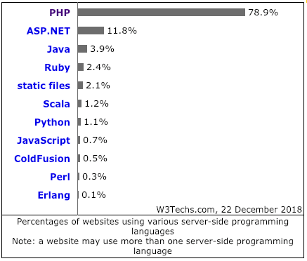
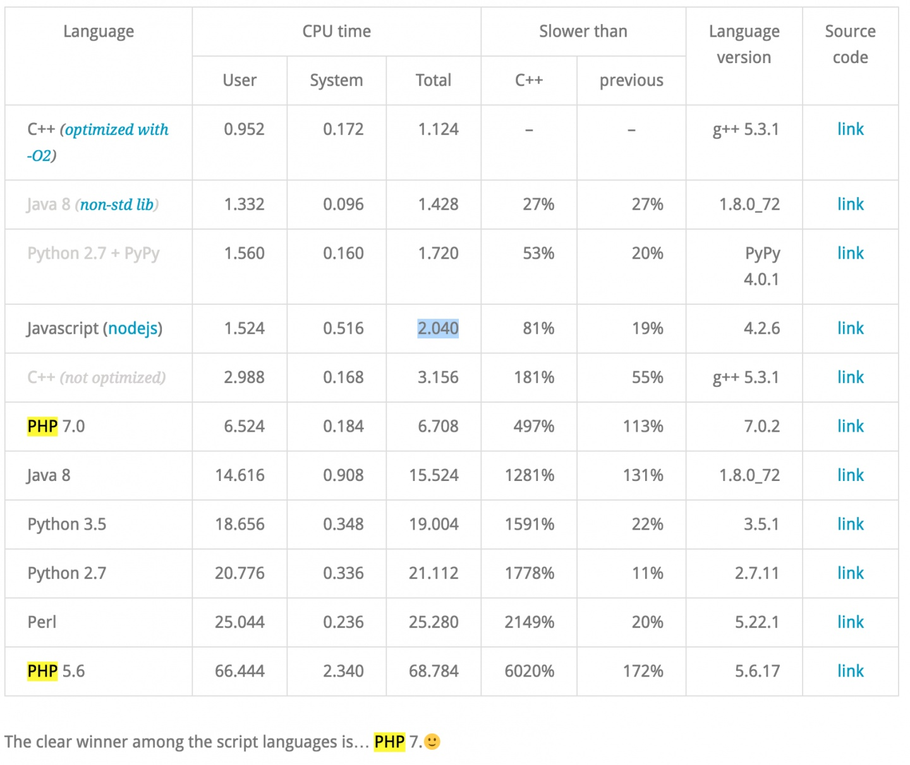

> 尊重版权转载请注明出处： **后盾人 @ houdurnen.com**

# 文档说明 

为了让大家学习时更加方便，我们不只在 houdurnen.com 上提交视频教程，同时提供全套视频代码与文档等素材，下面是项目地址。

* http://gitee.com/houdunren/code
* http://github.com/houdunwang/coding

> 视频教程已经免费发布，看视频学习更生动 [houdunren.com](http://www.houdunren.com)

# 语言介绍

## 占有率高

PHP（外文名:PHP: Hypertext Preprocessor，中文名：“超文本预处理器”）是一种通用开源脚本语言。利于学习，使用广泛，主要适用于Web开发领域。。

截至 2018 年，近 80％ 的互联网网站基于 PHP 开发和运行，下图是[w3techs](https://w3techs.com)提供的PHP在[web开发市场占有率](https://w3techs.com/technologies/details/pl-php/all/all)。


PHP 在服务器脚本语言市场[占有率](https://w3techs.com/technologies/overview/programming_language/all)中遥遥领先于其他对手：



上图是 [W3Techs](https://w3techs.com/technologies/overview/programming_language/all) 提供的 [服务器端脚本语言市场占有率](https://w3techs.com/technologies/overview/programming_language/all) 排名，根据数据显示 [Alexa](http://www.alexa.com/) 世界排名 **前一千万** 的网站，有 82.6% 使用 PHP 构建，此数据每日更新。

通过数据可以知道PHP语言是热度和使用度非常高，大部分商业网站都在使用PHP进行开发，显而易见PHP人才需要量巨大，学习和使用PHP语言是很有前途的。

## 性能强悍

PHP最新版本是PHP7，在性能和功能上都是史无前例的提升，下图是[Zend](http://www.zend.com/en/resources/php7_infographic)官方给出的PHP与其他语言[性能比较](http://www.zend.com/en/resources/php7_infographic)（数值越小性能越高）。


我们再来看看PHP7与以往版本相比较的[性能提升](http://www.zend.com/en/resources/php7_infographic)（数值越大性能越高）。


下面是 [PHP与Pyton&Java&Perl等主流语言](https://blog.famzah.net/2016/02/09/cpp-vs-python-vs-perl-vs-php-performance-benchmark-2016/) 的性能比较（注：排名越靠前越好）



 从运行结果分析，PHP7.0 比Python 快3倍，比Java也高出2倍多的速度，比自家PHP 5.6快出10位多。

> 脚本语言中明显的赢家是…PHP 7。🙂

 

# 基础知识

## 基础入门

### PHP是什么?

PHP(PHP: Hypertext Preprocessor，超文本预处理器的缩写)，是一种被广泛应用的开放源代码的、基于服务器端的用于产生动态网页的、可嵌入HTML中的脚本程序语言，尤其适合 WEB 开发。

当客户端向服务器的程序提出请求时，web服务器根据请求响应对应的页面，当页面中含有php脚本时，服务器会交给PHP解释器进行解释执行，将生成的html代码再回传给客户端，客户端的浏览器解释html代码，最终形成网页格式的页面。

### 执行方式

PHP 代码被包含在特殊的起始符和结束符中，使得网页的脚本可以进出“PHP 模式”。其它用 C 或 Perl 语言写的脚本，需要用大量的命令来编写程序以输出 HTML ，而用PHP 编写一个 HTML 脚本，只需嵌入了一些代码来完成操作（例如，在本例中输出了一些文本）。
和客户端的 JavaScript 不同的是，PHP 代码是运行在服务端的。如果在服务器上建立了如上例类似的代码，则在运行该脚本后，客户端就能接收到其结果，但他们无法得知其背后的代码是如何运作的。甚至可以将 web 服务器设置成让 PHP 来处理所有的 HTML 文件，这么一来，用户就无法得知服务端到底做了什么。

### PHP运行环境安装

大家在初始学习PHP时使用集成化开发环境是最好的选择，下面是常用的集成开发环境

| 集成开发软件 | 可使用的操作系统                   | 说明 |
| ------------ | ---------------------------------- | ---- |
| WAMP         | Win                                | 推荐 |
| XAMPP        | Win/Mac                            |      |
| Mamp         | Mac                                | 推荐 |
| Lamp         | Linux(CentOS/Fedora/Debian/Ubuntu) |      |

### PHP的特点

- 是开放源代码的，服务器端的脚本语言。
- 独立于操作系统，可以运行在几乎所有系统中。
- 支持大部分的服务器，如Apache,IIS。
- 支持大量的数据库，主要是Access\MySQL\SQL Server这三种。
- 可以创建图象。
- … …
- 还有一些其他特色功能在后面的高级技术详细介绍。
- 我们知道的网站如迅雷、新浪微博等大型网站都在使用PHP程序。

### C/S与B/S结构

**C/S结构**

C/S （Client/Server）结构，即大家熟知的客户机和服务器结构。它是软件系统体系结构，通过它可以充分利用两端硬件环境的优势，将任务合理分配到Client端和Server端来实现，降低了系统的通讯开销。目前大多数应用软件系统都是Client/Server形式的两层结构

**B/S****结构**

B/S（Browser/Server）结构即浏览器和服务器结构。它是随着Internet技术的兴起，对C/S结构的一种变化或者改进的结构。在这种结构下，用户工作界面是通过WWW浏览器来实现，极少部分事务逻辑在前端（Browser）实现，但是主要事务逻辑在服务器端（Server）实现。这样就大大简化了客户端电脑载荷，减轻了系统维护与升级的成本和工作量，降低了用户的总体成本。 

### 集成开发环境

**WAMP**

Windows下的Apache+Mysql/MariaDB+Perl/PHP/Python，一组常用来搭建动态网站或者服务器的开源软件，本身都是各自独立的程序，但是因为常被放在一起使用，拥有了越来越高的兼容度，共同组成了一个强大的Web应用程序平台。

**MAMP**

苹果系统下MAMP PRO是专业级版本的经典本地服务器环境的os x软件。MAMP这几个首字母代表苹果的OSX系统上的Macintosh、Apache、MySQL和PHP，顾名思义，你应该知道MAMP的强大功能 啦！MAMP 内含 Apache 伺服器、PHP 安装套件以及MySQL安装套件。 

### PHP的标记风格

```<?php 	… …  ?>```

这是PHP推荐使用的标记风格。服务器管理员不能禁用这种风格的标记。

### 分号

PHP用分号来分隔简单的语句。复合语句用大括号来标记代码块，如条件测试或循环，在大括号后面不要用分号。和其他语言不一样的是，在PHP中右括号(?>)前的分号不是必选的。

### 空白和换行符

一般来说，空白符在PHP中无关紧要。可以将一个语句展开成任意行，或者将语句紧缩在一行。
可以利用这个灵活的格式来使代码更具有可读性（通过排列分配、缩进等）。一些懒惰的程序员利用这种自由的格式创建根本无法阅读的代码，这是不提倡的。

### 程序的注释

PHP支持C、C＋＋和Shell脚本风格的注释，如下：

```
// 单行注释
/* ...*/  多行注释 		（注意：不能嵌套）
# 脚本注释
```

### 查看数据

**echo**

输出一个或多个变量，他不是函数，不需要使用括号，如果输出多个请用逗号分隔

```echo 1,2,3,4;```

**var_dump**

打印变量的相关信息

`var_dump(1234);`

区别：echo 是直接输出，var_dump输出和带有变量类型

## 变量知识

### 定义变量

PHP是弱类型语言，不像其他语言需要对变量进行类型声明。PHP中以 $ 作为前缀来定义变量，以a~z（大小写）或 _ 下划线定义变量名。

下面是合法的变量名

```
$hd =  'houdurnen.com';
$_name = '向军大叔';
```

下面是非法的变量声明

```
$999 = 'yahoo.com'
$&* = 'sina.com.cn'
```

### 弱类型

PHP是一种非常弱的类型语言。在大多数编程语言中，变量只能保持一种类型的数据，而且这个类型必须在使用变量前声明，例如C语言中。

而在PHP中，变量的类型通常不是由程序员设定的，确切地说，是根据该变量使用的上下文在运行时（即变量的值）决定的。

简单来说，var = 1;就是数字，var2 = '1'就是字符串，变量类型是由值决定的。 

### 传值与引用

**传值赋值**

直接使用 `=` 将变量的值赋值给另一个变量。

```
$a = 1;
$b = $a;
$b = 2;
echo $a;//结果是1
```

**引用赋值**

将一个变量的内存地址赋值给另一个变量的行为即传址赋值。需要在 `=` 等号前加上 `&` 引用符号，这样两个变量指向内存中的一个地址，任何一个变量的改变都影响到另一个变量，有点类似于快捷方式的概念。

```
$a = 1;
$b = &$a;
$b = 2;
echo $a;//结果是2
```

### 可变变量

可以变量即使用一个变量的值，作为另一个变量名。

```
$a = 'hello';	//普通变量
$$a = 'world';	//可变变量 相当于：$hello = ‘world’;
echo "$a ${$a}";//输出：hello world
echo "$a $hello";//输出：hello world
```

### 变量作用域

变量作用域指变量在代码中可以访问的位置。

#### 超全局变量

可以代码的任何位置都可以访问的变量

| 变量      | 说明                           |
| --------- | ------------------------------ |
| $_GET     | 地址栏GET提交                  |
| $_POST    | 表单POST提交                   |
| $_FILES   | 文件上传变量                   |
| $_SESSION | 会话变量                       |
| $_COOKIE  | cookie值变量                   |
| $_GLOBALS | 全局变量                       |
| $_REQUEST | 包含\$_GET、\$_POST、\$_COOKIE |
| $_SERVER  | 服务器环境变量                 |

#### 全局变量

全局声明（函数外声明）的变量会保存在 `$_GLOBALS` 中，函数内默认不能访问到全局变量，在函数中访问需要使用 `global` 关键字。

```
$hd='后盾人';
function p() {
	//利⽤ global 引入全局变量
	global $hd; 
	echo $hd;
}
p(); 
```

> 也可以使用全局数组\$GLOBALS调⽤用全局变量量。 如： \$GLOBALS['hd'];

#### 检测变量

通过isset 函数可以检测变量是否定义。

```
var_dump(isset($name));
# 结果是false
```

#### 变量销毁

php在全部代码执行结束后会删除所有变量，也使用 `unset` 函数可以在程序运行中删除变量。

```
$name='houdunren.com';
unset($name);
```

全局变量不能在函数中删除

```
$name = 'houdunren.com';
function run()
{
    global $name;
    unset($name);
}
run();
echo $name;
# 依然可以输出 houdurnen.com
```

### 静态变量

PHP支持声明函数变量为静态的(static)。一个静态变量在所有对该函数的调用之间共享，并且仅在脚本的执行期间函数第一次被调⽤时被初始化。
要声明函数变量为静态的⽤关键字static。通常静态变量的第一次使⽤用时赋予⼀个初始值。

```
function calculate()
{
    static $a=1;
    return ++$a;
}
calculate();
echo calculate();
```

## 数据类型

使用不同数据类型储存不同数据，就像我们家里面放衣服和放洗手液会使用用不同的容器一样。下面是常用PHP数据类型表：

| 类型    | 说明   |
| ------- | ------ |
| integer | 整型   |
| float   | 浮点型 |
| string  | 字符串 |
| boolean | 布尔型 |
| array   | 数组   |
| object  | 对象   |

### 整型

整型可以是十进制、八进制、十六进制。

```
01988 #十进制
0xfff #十六进制
```

下面是 777 八进制数转成 10进制数，即逢8进1原则，PHP中使用 octdec() 函数可以将8进制转为10进制。
$$
7*8^2+7*8^1+7*8^0 = 511
$$

下面是十六进帛 `FAF` 转为10进制数，PHP中使用hexde()函数将16进制转为10进制

$$
15*16^2+10*16^1+15*16^0
$$

### 浮点数

浮点数表示实数，可理解为有限或无限小数。

```
0.12
-10.98
```

### 布尔型

当转换为 boolean 时，以下值被认为是FALSE：这个地方提示学生不用记，按照自己的感觉来就可以判定了，读完一遍之后把ppt关掉，提问true还是false，学生都会知道的

1. 布尔值 FALSE
2. 整型值 0（零）
3. 浮点型值 0.0（零）
4. 空白字符串
5. 字符串 "0"
6. 没有成员变量的数组
7. 没有单元的对象（仅适用于 PHP 4）
8. 特殊类型 NULL（包括尚未设定的变量）

所有其它值都被认为是 TRUE

### 字符串

#### 定义

**引号**

字符串可以用双引号"" 或 '' 号包含，区别是双引号中可以解析变量。

```
$url = 'houdunren.com';
$string = "后盾人网址是 {$url}";
```

在所有输出前使用下面的代码可以正确显示中文：

```
header('Content-type:text/html;charset=utf-8');
```

**定义符**

定界符文本表现的就和双引号字符串一样，在定界符文本中不需要转义引号，适合输入大量文本。

结束符必须从第一列开始，并且后面除了分号以外不能包含任何其他字符，空格也不可以。

```
$string =<<<str
这是使用定界符输入的内容
str;
echo $string;
```

**连接符**

多个字符串使用 . 符号连接

```
$name = '后盾人';
$url  = 'houdunren.com'
echo $name.$url;
```

#### 转义

转义是将有多种含义的字符进行转换，比如 $即是变量前缀也是美元符号，就需要转义在不同场景进行改变。

```
echo  "变量定义 \$name = 'houdunren.com',学会了吗？";
```

#### 常用函数

strlen — 取得字符串长度传度的函数

```
echo strlen('houdunren.com');
```

mb_strlen — 根据字符编码获取长度

```
echo mb_strlen('后盾人','utf8');
```

trim — 截去字符串首尾的内容

```
$string = ' houdunren.com  ';
echo strlen(trim($string,' moc'));
# 从前后删除 moc和空格字符
```

rtrim从右侧删除、ltrim从左侧删除

```
$string = ' houdunren.com  ';
echo strlen(rtrim($string,' moc'));
```

strtolower — 字母转为小写

```
$str = "Mary Had A Little Lamb and She LOVED It So";
$str = strtolower($str);
echo $str; // Prints mary had a little lamb and she loved it so
```

strtoupper — 字母转大写

```
$str = "Mary Had A Little Lamb and She LOVED It So";
$str = strtoupper($str);
echo $str; // Prints MARY HAD A LITTLE LAMB AND SHE LOVED IT SO
```

ucfirst — 将字符串的首字母转换为大写

```
$foo = 'hello world!';
$foo = ucfirst($foo); // Hello world!
```

ucwords — 将字符串中每个单词的首字母转换为大写

```
$foo = 'hello world!';
$foo = ucwords($foo);             // Hello World!

$foo = 'hello|world!';
$baz = ucwords($foo, "|");        // Hello|World!
```

md5 — 计算字符串的 MD5 散列值，以 32 字符十六进制数字形式返回散列值

```
md5('houdunren.com') //962ff8546a001f8f6d0adecf08905d14
```

explode — 使用一个字符串分割另一个字符串

```
$pizza  = "piece1 piece2 piece3 piece4 piece5 piece6";
$pieces = explode(" ", $pizza);
echo $pieces[0]; // piece1
echo $pieces[1]; // piece2
```

implode — 将一个一维数组的值转化为字符串

```
$array = array('lastname', 'email', 'phone');
$comma_separated = implode(",", $array);

echo $comma_separated; // lastname,email,phone
```

substr — 返回字符串的子串

```
$rest = substr('abcdef', 1);     // bcdef
$rest = substr('abcdef', 1, 3);  // bcd
$rest = substr("abcdef", 0, -1);  // 返回 "abcde"
$rest = substr("abcdef", 2, -1);  // 返回 "cde"
$rest = substr("abcdef", 4, -4);  // 返回 ""
$rest = substr("abcdef", -3, -1); // 返回 "de"
```

mb_substr — 获取部分字符串

```
echo mb_substr('后盾人', 1, 1, 'utf-8'); //盾
```

strstr — 查找字符串的首次出现

```
$email  = 'name@example.com';
$domain = strstr($email, '@');
echo $domain; // 打印 @example.com
```

strrchr — 查找指定字符在字符串中的最后一次出现

```
echo strrchr('hdcms.jpg', '.'); // .jpg
```

strpos — 查找字符串首次出现的位置，如果没找到，将返回 **FALSE**

```
echo strpos('houdurnen.com', 'o'); // 返回1
```

strrpos — 计算指定字符串在目标字符串中最后一次出现的位置

```
echo strrpos('houdurnen.com', 'o'); // 返回11
```

str_replace — 子字符串替换

```
echo str_replace('houdunren', 'hdcms', 'houdunren.com'); //返回 hdcms.com

echo str_replace(['小猫','小狗'], '*', '我家有一只可爱的小猫和小狗');//我家有一只可爱的*和*

echo str_replace(['小猫','小狗'], ['猫猫','旺旺'], '我家有一只可爱的小猫和小狗'); //我家有一只可爱的猫猫和旺旺
```

### NULL

NULL数据类型只有一个值NULL。

1. 变量未被赋予任何值
2. 变量被赋值为NULL
3. 被unset()函数处理后的变量

```
\$a;		//变量 \$a未被赋予任何变量，值为NULL
\$b = NULL;	//变量 \$b被赋值为NULL
\$c = 10;		

unset($c);	
//使用unset()函数处理后，\$c为NULL 
```

### 相关函数

**getType()** 

```php
\$num = 1234; 
\$type = gettype(\$num); 
var_dump(\$type);
```

检测是否为布尔型

```
\$var = true;
\$bool = is_bool(\$var);
var_dump(\$bool);
```

检测是否为整型

```
$int = 1234; 
$bool = is_int($int); 
var_dump($bool);
```

检测是否为浮点数

```
$num = 1.1234; 
$bool = is_float($num); 
var_dump($bool);
```

检测是否为字符串

```
$string = 'houdunwang'; 
$bool = is_string($string); 
var_dump($bool);
```

检测是否为NULL

```
$var = null;
$bool = is_null($var);
var_dump($bool);
```

### 类型转换

自动转换

PHP类型根据值，自动转换

```
$num1 = '1'; 
$num2 = '2'; 
echo $num1 + $num2; # 字符串转为数字相加
```

强制转换 

```
settype($var,'type'); # type类型为integer、double、string、array 与 object

$var = '123'; 

settype($var,’integer’);
var_dump($var); 就会变成int类型

intval() $var = '123'; 
var_dump(intval($var));

floatval() $var = '1.23';
var_dump(floatval($var));

strval() $var = 123;
var_dump(strval($var));
```

## 常量使用

常量是一个简单值的标识符（名字）。常量默认为大小写敏感。按照惯例常量标识符总是大写的。 

**常量特性**

- 常量前面没有美元符号（$）
- 常量只能用define() 函数定义，而不能通过赋值语句
- 常量一旦定义就不能被重新定义或者取消定义
- 常量的值用来定义 整型，浮点，字符串，布尔值，数组（PHP7新增）
- 常量可以不用理会变量范围的可以在任何位置访问

**声明常量**

常量可以使用 `const` 和 `define` 定义。

- const 是语言结构，在编译时要比define快
- define 可以设置第三个参数为true，来定义不区分大小写的常量
- 类文件中定义常量也使用const，所以const统一易读

```
define('常量名',值); 
define('WEBNAME','houdunwang');
echo WEBNAME;
```

**常量检测**

```
$bool = defined('WEBNAME');
var_dump($bool); // 结果是false
```

**系统常量**

```
__DIR__			文件所在目录
__FILE__		文件路径
__LINE__		程序代码行号
PHP_VERSION 	显示PHP版本
PHP_OS   		显示服务器的操作系统版本
TRUE			boolean值真(true)支持小写常量
FALSE 			boolean值假(false)支持小写常量
__FUNCTION__	函数名称
__METHOD__		方法名称
__CLASS__		类名称
```

使用函数 `get_defined_constants(true)` 可以获取当前可使用的所有常量。

## 运算符

### 算术运算符

| 运算符 | 说明                                    |
| ------ | --------------------------------------- |
| \$a+\$b  | 加法	\$a和\$b的和                      |
| \$a-\$b  | 减法	\$a和\$b的差                      |
| \$a*\$b  | 乘法	\$a和\$b的积                      |
| \$a/\$b  | 除法	\$a除以\$b的商                    |
| \$a%\$b  | 取模	\$a除以\$b后的余                  |
| ++\$a   | 前加  \$a 的值先加一，然后进行操作 |
| \$a++   | 后加 	\$a 的值先进行操作，后加一      |
| --\$a   | 前减  \$a 的值先减一，然后进行操作 |
| \$a--   | 后减  \$a 的值先进行操作，后减一    |

### 赋值运算符

| 运算符 | 说明                                 |
| ------ | ------------------------------------ |
| =      | 右边值赋值给左边变量                 |
| +=     | 左边值加上右边值赋值给左边变量       |
| -=     | 左边值减掉右边值赋值给左边变量       |
| *=     | 左边值乘以右边值赋值给左边变量       |
| /=     | 左边值除以右边值赋值给左边变量       |
| .=     | 左边字符串连接到右边变量后面         |
| %=     | 左边值对右边值取余数后赋值给左边变量 |

### 字符串运算符

| 运算符 | 说明                           |
| ------ | ------------------------------ |
| .      | 它返回其左右参数连接后的字符串 |
| .=     | 左边字符串连接到右边变量后面   |

### 比较运算符

| 运算符  | 说明                                             |
| ------- | ------------------------------------------------ |
| `$a==$b`  | 等于		TRUE，如果\$a等于\$b                   |
| `$a===$b` | 全等于 	TRUE，如果\$a等于\$b，并且类型也相同    |
| `$a!=$b`  | 不等		TRUE，如果\$a不等于\$b                 |
| `$a<>$b`  | 不等		TRUE，如果\$a不等于\$b                 |
| `$a!==$b` | 非全等		TRUE，如果\$a不等于\$b，或者类型不同 |
| `$a<$b`   | 小于		TRUE，如果$a严格小于\$b               |
| `$a>$b`   | 大于		TRUE，如果\$a严格\$b                   |
| `$a<=$b`  | 小于等于	TRUE，如果 \$a 小于或者等于\$b         |
| `$a>=$b`  | 大于等于	TRUE，如果 \$a 大于或者等于\$b         |

### 逻辑运算符

| 运算符      | 说明                                     |
| ----------- | ---------------------------------------- |
| \$a and \$b | 逻辑与	TRUE，如果 \$a 与 \$b 都为 TRUE  |
| \$a or \$b    | 逻辑或	TRUE，如果 \$a 或 \$b 任一为TRUE |
| !\$a         | 逻辑非	TRUE，如果 \$a 不为 TRUE        |
| \$a && \$b    | 逻辑与	TRUE，如果 \$a 与 \$b 都为TRUE   |
| `$a || $b` |逻辑或	TRUE，如果 \$a 或 \$b 任一为TRUE|

and与&& 、or与||是同一逻辑运算符的两种写法，但优先级不同。

这四个符号的优先允许从高到低是：&&、||、AND、OR。

### 三元表达式

变量=(表达式)？值1:值2;
当表达式的返回值为true时，$变量被赋予值1，否则被赋予值2

```
echo true?'向军':'后盾人'; //返回向军
```

**?? 与 ?:**

```
$var=0;
echo $var?:'大叔'; #输出大叔

$var=0;
echo $var??'大叔';#输出0
```

PHP 7 新增加的 NULL 合并运算符（??）是用于执行isset()检测的三元运算的快捷方式。
?: 只判断 true 或 false ，而 ?? 判断变量存在并且值不为null

### 屏蔽错误

@ 运算符用于屏蔽表达式警告错误

```
@(20/0); 
```

## 流程控制

### if/else/elseif

当条件表达式的值为真（true）时，PHP将执行语句组，相反条件表达式的值为假（false）时，PHP将不执行语句组，忽略语句组执行下面的语句。

```
if (true) {
    echo '向军大叔';
} else {
    echo '不成立';
}

//也可以使用以下写法
if (true) :
    echo '向军大叔';
 else :
    echo '不成立';
 endif;
```

**elseif**

```
$age = 10;
if ($age<=15) {
    echo '儿童';
} elseif ($age<=30) {
    echo '青年';
} elseif ($age<=50) {
    echo '中年';
} else {
    echo '尊敬的老人';
}

//也可以使用以下写法
$age = 10;
if ($age<=15) :
    echo '儿童';
elseif ($age<=30) :
    echo '青年';
elseif ($age<=50) :
	echo '中年';
else :
    echo '尊敬的老人';
endif;
```

### switch

switch设置多个执行代码块，break指令终止向下执行，default为上面条件都不满足时执行的默认代码块。

```
switch ($status) {
case 'success':
    echo '成功';
    break;
case 'error':
    echo '错误';
    break;
case 'warning':
    echo '警告';
    break;
}

//也可以使用以下写法
switch ($status) :
    case 'success':
        echo '成功';
        break;
    case 'error':
        echo '错误';
        break;
    case 'warning':
        echo '警告';
        break;
endswitch;
```

### while

当while循环语句中表达式（循环控制语句）的结果为真时，程序将反复执行同一段程序：循环体（ while中的语句或语句序列），直到满足一定的条件（表达式的结果为假时）后才停止执行该段程序。

```
$num = 10;
while ($num>0) {
    echo($num--).'<br/>';
}

//也可以使用以下写法
$num = 10;
while ($num>0):
    echo($num--).'<br/>';
endwhile;
```

### do...while

与while的差别是条件后判断。

```
$num = 10;
do {
    echo($num--).'<hr/>';
} while ($num>0);
```

### for

```
for(表达式1;表达式2;表达式3){
	语句或语句序列;
}
// 表达式1为循环初始条件；
// 表达式2为循环控制条件；
// 表达式3为控制变量递增；
```

```
for ($num=10;$num>0;$num--) {
    echo $num.'<hr/>';
}
// 也可以使用以下写法
for ($num=10;$num>0;$num--) :
    echo $num.'<hr/>';
endfor;
```

### break 与 continue

**break **

我们之前在 switch 条件判断中已经使用过 break 关键字，它会使得程序流程离开 switch 本体中的语句，如果 break 使用在 for、while 或 do-while 循环结构中时，将会使得程序离开该层循环。

```
do {
    if (!isset($num)) {
        $num=10;
    }
    if ($num==0) {
        break;
    }
    echo($num--).'<hr/>';
} while (true);

```

break 在多层循环嵌套使用时，可以指定跳转出层数。

```
$num=0;
while (true):
    $num++;
    switch ($num) {
        case $num%2==0:
            echo $num."<hr/>";
            break;
        case $num%15==0:
            echo $num."<hr/>";
            break 2;
    }
endwhile;
```

**continue**

continue 的作用与 break 有点类似，continue 若使用在 for、while 或 do-while循环结构中，当程序执行至 continue 时，之后的语句将直接被略过，而直接执行下一次的循环动作。 

```
for ($num=10;$num>0;$num--) {
    if(!($num%2))continue;
    echo $num.'<hr/>';
}
```

## 文件引入

**include & require**

使用include和require 将文件导入，就像把该文件粘贴到使用函数的地方。

include( )与require ( )区别在于错误处理方式，当引入产生错误时include( )产生一个警告而require( )则导致一个致命错误。

```
include './test.php'; 
echo 'test'; //如果test.php文件不存在会报一个warning错误，但是可以输出test
```

可以使用 @ 屏蔽incluce加载警告错误

```
if (!@include 'a.php') {
    echo '文件不存在';
}
```

require 加载失败时将终止程序执行

```
require './test.php'; 
echo 'test'; //如果test.php文件不存在会报一个fatal错误，不可以输出test
```

**include_once和require_once**

与include( )语句及require( )区别是如果文件已经加载过，则不会重复加载文件。

```
// 因为 include 每次都加载所以下面两行代码执行会报错
include './functions.php';
include './functions.php'; 

//下面使用 include_once 就不会报错
include_once './functions.php';
include_once './functions.php';
```

## 函数编程

函数（function）是一段完成指定任务的已命名代码，函数可以遵照给它的一组值或参数完成任务，并且可能返回一个值。使用函数可以节省编译时间，因为无论调用多少次，函数只需被编译一次。

**函数的特性：**

1. 控制程序设计的复杂性
2. 提高软件的可靠性
3. 提高软件的开发效率
4. 提高软件的可维护性
5. 提高程序的重用性

### 函数语法

```
function  函数名称（参数1，参数2 …）{
	//程序业务内容
	return 返回值； //如需函数有返回值时使用，否则函数返回值为null
} 
```

**函数名称**

它是函数在程序代码中的识别名称，函数名可以是以字母或下划线开头后跟零个或多个字母、下划线和数字的任何字符串。函数名不区分大小写。

命名函数时不可使用已声明的函数，或PHP内建的函数名称。

**返回值**

当调用函数时需要它返回一些数值，那么就要函数体中用return语句实现。格式如下：

```
return '返回值'; //返回值也可以是一个表达式
```

如果函数中没有使用return返回值时则函数返回值为null

### 函数检测

function_exists 用于检测函数是否定义

```
//检测hd这个函数是否定义：
var_dump(function_exists('hdcms'));
```

### 命名空间

使用命名空间可以将函数声明在指定空间，防止函数重名引起冲突。

下面是定义 `User.php` 与 `Article.php` 两个文件内容如下：

User.php 文件内容

```
namespace User;
function show()
{
    echo __NAMESPACE__.'\\'.__FUNCTION__.'<hr/>';
}
```

Article.php 文件内容

```
namespace User;
function show()
{
    echo __NAMESPACE__.'\\'.__FUNCTION__.'<hr/>';
}
```

在 Test.php 使用

```
include 'User.php';
include 'Article.php';
User\show();
Article\show();
```

使用命名空间后就可以定义相同名称的函数了。

### 严格模式

在文件头部定义`declare(strict_types=1)` 为严格模式，这样会对函数参数类型进行严格约束。

```
// 必须定义在文件头
declare(strict_types=1);
//参数必须为int类型
function handle(int ...$num)
{
    return array_sum($num);
}
try {
	//参数类型错误抛出异常
    echo handle(1, '2', 3);
} catch (\Throwable $th) {
    echo $th->getMessage();
}
```

### 返回值类型

PHP7中我们可以设置函数允许的返回值类型。

```
function make():int
{
    return '向军大叔';
}

try {
    make();
} catch (\Throwable $th) {
    echo $th->getMessage();
}
```

如果设置 `?int` 表示返回类型为 `int`  或 `null`

```
function make():?int
{
    return null;
}

try {
    var_dump(make());
} catch (\Throwable $th) {
    echo $th->getMessage();
}
```

系统会对返回值自动处理

```
function make():String
{
    return 100;
}

try {
    var_dump(make());
} catch (\Throwable $th) {
    echo $th->getMessage();
}
```

如果不希望函数返回任何值时，设置返回值为 `void`

```
function make():void
{
    return '向军大叔';
}

try {
    var_dump(make());
} catch (\Throwable $th) {
    echo $th->getMessage();
}
```

### 变量范围

**变量能见度**

所谓变量的能见度，意指变量在程序中的可作用范围。当一个变量执行赋值动作后，会随着声明局部的差异，而有不同的作用范围。大致上来说变量会依据声明的局部分为下列两种：局部变量和全局变量。

**局部变量**

在函数之中声明的变量就是局部变量，并且该变量只有在函数范围之中才能加以使用。如果其它程序局部需要调用使用该变量值时，必须透过「return」指令，来将其传回至主程序区块以作后续处理。

```
$hd=0;
function p(){ 
	$hd = 3;	//定义局部变量
	echo "在函数中显示局部变量\$hd值: $hd </br>";
}
p();
echo "在函数外显示变量\$hd值: $hd <br>";
```

**全局变量**

在函数范围之外声明的变量为全局变量，在函数无法直接使用全局变量，函数要使用全局变量，必须要利用global引入或 $GLOBALS超全局数组引入。

```
$hd=“后盾网”; 
function p() { 	
	global $hd; //利用 global 引入全局变量
	echo $hd;
}
p();
```

**静态变量**

PHP支持声明函数变量为静态的(static)。一个静态变量在所有对该函数的调用之间共享，并且仅在脚本的执行期间函数第一次被调用时被初始化。要声明函数变量为静态的用关键字static。通常，静态变量的第一次使用时赋予一个初始值。

### 参数传递

**按值传递参数**

父程序直接传递指定的值或是变量给函数使用。由于所传递的值或变量，与函数里的数值分别储存于不同的内存区块，所以当函数对所导入的数值作了任何变动时，并不会对父程序造成直接影响。

**按址传递参数(用“&”符号实现)**

相对于按值传递模式，并不会将父程序中的指定数值或目标变量传递给函数，而是把该数值或变量的内存储存区块相对地址导入函数之中。因此当该数值在函数中有任何变动时，会连带对父程序造成影响。	

**点语法**

当传递的参数数量确定时，可以使用…与变量名。函数的所有参数会成为变量的数组元素。

```
function sum(...$args)
{
    return array_sum($args);
}
echo sum(1, 2, 3);
```

**参数默认值**

php支持函数的默认方式调用。如果在调用函数时没有指定参数的值，在函数中会使用参数的默认值。 默认参数必须列在所有没有默认值参数的后面。

### 变量函数

PHP 支持变量函数的概念。这意味着如果一个变量名后有圆括号，PHP 将寻找与变量的值同名的函数，并且将尝试执行它。除了别的事情以外，这个可以被用于实现回调函数，函数表等等。

变量函数不能用于语言结构，例如 echo()，print()，unset()，isset()，empty()，include()，require() 以及类似的语句。需要使用自己的外壳函数来将这些结构用作变量函数。 

### 递归调用

所谓的函数递归调用，就是函数可以在其声明的执行叙述之中调用执行自己。

通常在此类型的函数之中会附加一个条件判断叙述，以判断是否需要执行递归调用，并且在特定条件下终止函数的递归调用动作，把目前流程的主控权交回上一层函数执行。因此当某个执行递归调用的函数，没有附加条件判断叙述时可能会造成无限循环的错误情形。

函数递归调用最大的好处在于可以精简程序中繁杂重复调用程序，并且能以这种特性来执行一些较为复杂的运算动作。

```
function recursive($n)
    if ($n > 1){
    	$r=$n*facto($n-1);}
  	else{ 
    	$r=$n;
    }
    return $r;
}
echo "当 N 值为 5 时,阶乘为: ".recursive(5)."<br>";
echo "当 N 值为 10 时,阶乘为: ".recursive(10);
```


## 数组类型

数组是在程序设计中，为了处理方便， 把若干变量按有序的形式组织起来的一种形式。
按数组键值类型的不同，数组又可分为数值索引数组、字符关联数组。

### 基础知识

- 所谓的数组下标可以视为资料内容在此数组中的识别名称，通常被称为数组下标。
- 当索引值为数值时，也代表此资料内容在数组中的储存位置。
- 数组中有几个索引值就被称为几维数组。

**数组分类**：

在PHP中有两种数组：索引数组和关联数组。

- 索引（indexed）数组的索引值是整数，以0开始。当通过位置来标识东西时用索引数组。
- 关联（associative）数组以字符串做为索引值，关联数组更像操作表。索引值为列名，用于访问列的数据

```
$arr 	= [1,2,3] // 索引数组
$users 	= ['name'=>'向军大叔','age'=>99]; //关联数组
```

**一维数组**

数组值为单个变量（非数组）时，为一维数组

```
$arr = ['name'=>'向军','url'=>'houdunren.com'];
```

**多维数组**

数组的值为数组时，这样的数组为多维数组，嵌套几层即几为数组

```
$users = [
	['name'=>'向军'],
	['name'=>'李四']
];
```

**数组赋值**

```
$arr = [];
$arr[0] = '后盾人';
$arr['url']=>'houdunren.com';
```

### 读取元素

key — 从关联数组中取得键名

```
$arr = ['后盾人','HDCMS','向军大叔'];
echo key($arr); //返回0
```

current — 返回数组中的当前单元

```
$arr = ['后盾人','HDCMS','向军大叔'];
echo current($arr); //返回 '后盾人'
```

next — 将数组中的内部指针向下移动一位，并返回值。没有更多单元时返回 **FALSE**

```
$arr = ['后盾人','HDCMS','向军大叔'];
echo next($arr); //返回 'HDCMS'
```

prev — 将数组的内部指针倒回一位，并返回值。没有更多单元时返回 **FALSE**

```
$arr = ['后盾人','HDCMS','向军大叔'];
var_dump(prev($arr)); //返回 FALSE
```

### 遍历数组

**foreach**

```
$users = [
    ['name'=>'向军大叔','url'=>'aoxiangjun.com'],
    ['name'=>'后盾人','url'=>'houdunren.com']
];
foreach ($users as $key=>$user) {
    echo "[{$key}] 姓名:{$user['name']} 网址:{$user['url']} <hr/>";
}
```

**指针遍历**

```
do {
    $user = current($users);
    $key = key($users);
    echo "[{$key}] 姓名:{$user['name']} 网址:{$user['url']} <hr/>";
} while (next($users));
```

